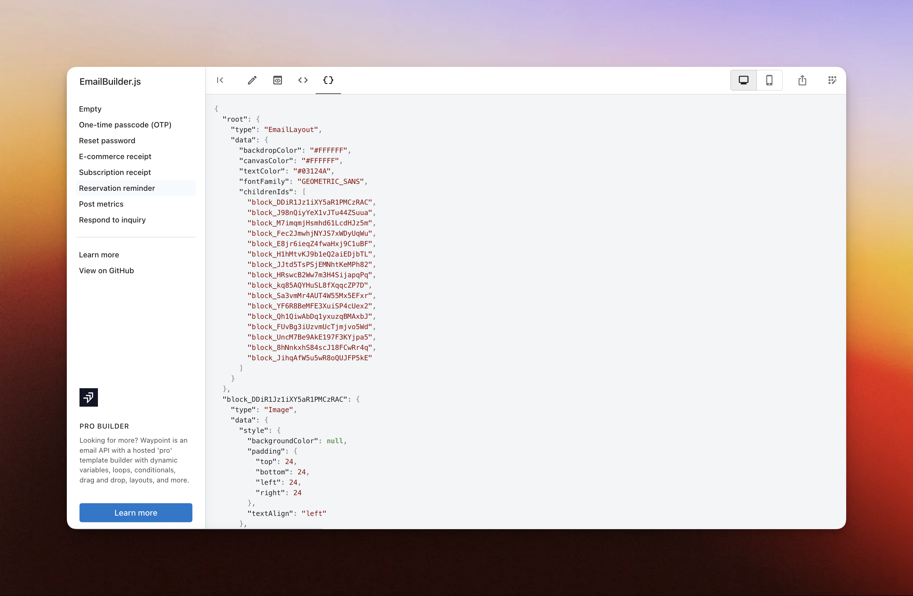

<div align="center">
  <h1>EmailBuilder.js</h1>
  <p align="center">
    <a href="https://usewaypoint.github.io/email-builder-js/#sample/reservation-reminder">Demo / Playground</a>&emsp;&middot;&emsp;
    <a href="https://www.usewaypoint.com/open-source/emailbuilderjs?utm_source=emailbuilderjs-github">Website</a>&emsp;&middot;&emsp;
    <a href="https://github.com/usewaypoint/email-builder-js">GitHub</a>
  </p>
</div>

## Introduction

EmailBuilder.js is a free and open-source email template builder for developers. Build emails faster than ever with clean JSON or HTML output that render well across clients and devices. Self-host or [use our playground](https://usewaypoint.github.io/email-builder-js/#sample/reservation-reminder) to get started building emails.


Brought to you by the [Waypoint](https://usewaypoint.com/) team.

<br>

## Build simple welcome emails to complex reports

The builder is flexible enough to handle a wide variety of template designs – From simple welcome emails to complex reports.


Sample templates available in the playground:

- [One-time passcode (OTP)](https://usewaypoint.github.io/email-builder-js/#sample/one-time-password)
- [Reset password](https://usewaypoint.github.io/email-builder-js/#sample/reset-password)
- [E-commerce receipt](https://usewaypoint.github.io/email-builder-js/#sample/order-ecomerce)
- [SaaS subscription receipt](https://usewaypoint.github.io/email-builder-js/#sample/subscription-receipt)
- [Reservation reminder](https://usewaypoint.github.io/email-builder-js/#sample/reservation-reminder)
- [Post metrics](https://usewaypoint.github.io/email-builder-js/#sample/post-metrics-report)
- [Respond to inquiry](https://usewaypoint.github.io/email-builder-js/#sample/respond-to-message)

<br>

## Why?

It's time to finally stop using 90's style HTML and CSS to build product emails. EmailBuilder.js takes inspiration from [editor.js](https://github.com/codex-team/editor.js) and email component libraries and puts them into an easy to use no-code builder to that allow the entire team to contibute to building emails.

Since the builder is completely free and open source, teams can self-host the builder and extend as needed.

<br>

## Built-in blocks

Each block is it's own npm package that can be included in the builder. These are the ones that are built-in:

- [Avatar](https://github.com/usewaypoint/email-builder-js/tree/main/packages/block-avatar)
- [Button](https://github.com/usewaypoint/email-builder-js/tree/main/packages/block-button)
- [Columns](https://github.com/usewaypoint/email-builder-js/tree/main/packages/block-columns-container)
- [Container](https://github.com/usewaypoint/email-builder-js/tree/main/packages/block-container)
- [Divider](https://github.com/usewaypoint/email-builder-js/tree/main/packages/block-divider)
- [Heading](https://github.com/usewaypoint/email-builder-js/tree/main/packages/block-heading)
- [HTML](https://github.com/usewaypoint/email-builder-js/tree/main/packages/block-html)
- [Image](https://github.com/usewaypoint/email-builder-js/tree/main/packages/block-image)
- [Spacer](https://github.com/usewaypoint/email-builder-js/tree/main/packages/block-spacer)
- [Container](https://github.com/usewaypoint/email-builder-js/tree/main/packages/block-text)

<br>

## Email client support

All blocks are [tested and supported](https://www.usewaypoint.com/docs/email-client-support) by modern email clients (on both desktop and mobile) including: Gmail, Apple Mail, Outlook, Yahoo! Mail, HEY and Superhuman.


## Output and sending emails

From the builder, a clean JSON or raw HTML is available for download.



<br>

## Using EmailBuilder.js

Install the package in your project

```bash
npm install --save @usewaypoint/email-builder
```

Given an EmailBuilder configuration

```javascript
const CONFIGURATION = {
  // ...
};
```

Rendering your HTML email into a string

```javascript
import { renderHtmlDocument } from '@usewaypoint/email-builder';

const string = renderHtmlDocument(CONFIGURATION, 'root');
```

Rendering your email as a React component

```javascript
import { Reader } from '@usewaypoint/email-builder';

<Reader document={CONFIGURATION} rootBlockId="root" />;
```

## Brought to you by the Waypoint team

EmailBuilder.js is the community version of our more powerful and hosted template builder with dynamic LiquidJS variables, drag and drop, Markdown formatting, reusable layouts, loops, and additional blocks.

[Learn more about Waypoint](https://usewaypoint.com/)
