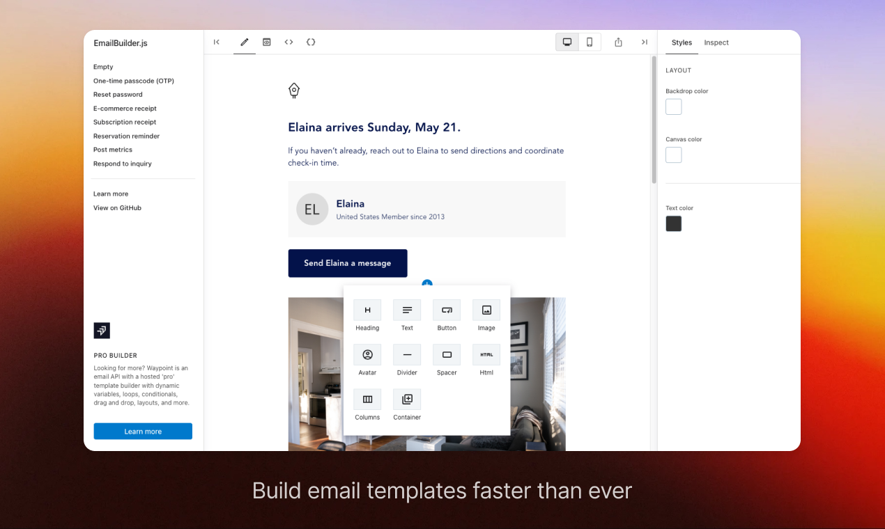
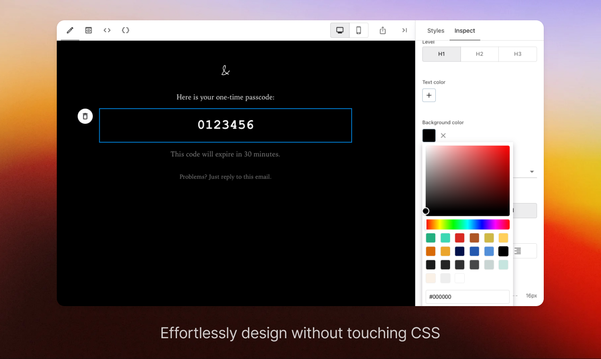
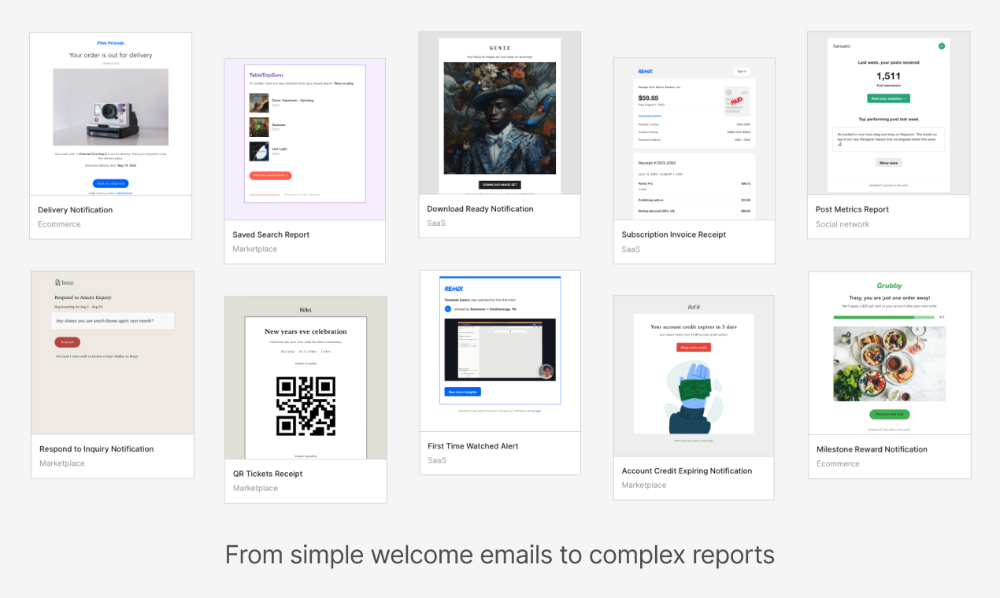
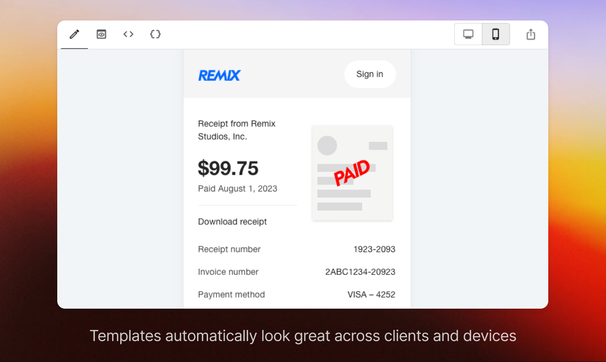
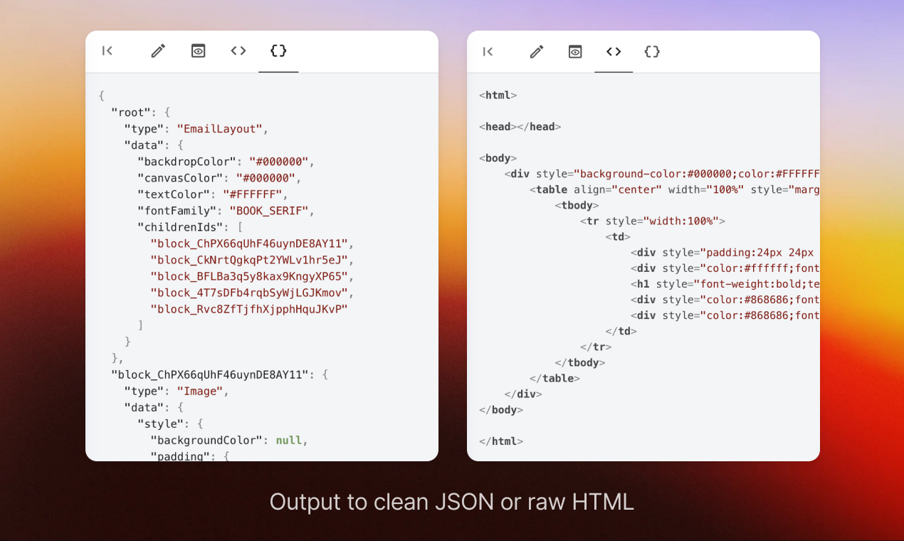

<div align="center">
  <h1>EmailBuilder.js</h1>
  <p align="center">
    <a href="https://usewaypoint.github.io/email-builder-js/#sample/reservation-reminder">Demo / Playground</a>&emsp;&middot;&emsp;
    <a href="https://www.emailbuilderjs.com">EmailBuilderJS.com</a>&emsp;&middot;&emsp;
    <a href="https://github.com/usewaypoint/email-builder-js">GitHub</a>
  </p>
</div>

## Introduction

EmailBuilder.js is a free and open-source email template builder for developers. Build emails faster than ever with clean JSON or HTML output that render well across clients and devices.

[Use our playground](https://usewaypoint.github.io/email-builder-js/#sample/reservation-reminder) or learn more about how to [get started using EmailBuilder.js](#using-emailbuilderjs).





<br>

## Build simple welcome emails to complex reports

Use a no-code builder that is flexible enough to create a wide variety of template designs – from simple welcome emails to complex reports.



Sample templates available in the playground:

- [Welcome email](https://usewaypoint.github.io/email-builder-js/#sample/welcome)
- [One-time passcode (OTP)](https://usewaypoint.github.io/email-builder-js/#sample/one-time-password)
- [Reset password](https://usewaypoint.github.io/email-builder-js/#sample/reset-password)
- [E-commerce receipt](https://usewaypoint.github.io/email-builder-js/#sample/order-ecomerce)
- [SaaS subscription receipt](https://usewaypoint.github.io/email-builder-js/#sample/subscription-receipt)
- [Reservation reminder](https://usewaypoint.github.io/email-builder-js/#sample/reservation-reminder)
- [Post metrics](https://usewaypoint.github.io/email-builder-js/#sample/post-metrics-report)
- [Respond to inquiry](https://usewaypoint.github.io/email-builder-js/#sample/respond-to-message)

<br>

## Why?

It's finally time to stop using 90's style HTML and CSS to build product emails. EmailBuilder.js takes inspiration from [editor.js](https://github.com/codex-team/editor.js) and email component libraries and puts them into an easy to use no-code builder to that allow the entire team to build emails.

Since the builder is completely free and open source, teams can self-host the builder and extend as needed.

<br>

## Built-in blocks

Each block is it's own npm package that can be included in the builder. These are the ones that are built-in:

- [Avatar](https://github.com/usewaypoint/email-builder-js/tree/main/packages/block-avatar)
- [Button](https://github.com/usewaypoint/email-builder-js/tree/main/packages/block-button)
- [Columns](https://github.com/usewaypoint/email-builder-js/tree/main/packages/block-columns-container)
- [Container](https://github.com/usewaypoint/email-builder-js/tree/main/packages/block-container)
- [Divider](https://github.com/usewaypoint/email-builder-js/tree/main/packages/block-divider)
- [Heading](https://github.com/usewaypoint/email-builder-js/tree/main/packages/block-heading)
- [HTML](https://github.com/usewaypoint/email-builder-js/tree/main/packages/block-html)
- [Image](https://github.com/usewaypoint/email-builder-js/tree/main/packages/block-image)
- [Spacer](https://github.com/usewaypoint/email-builder-js/tree/main/packages/block-spacer)
- [Container](https://github.com/usewaypoint/email-builder-js/tree/main/packages/block-text)

<br>

## Email client support

All blocks are [tested and supported](https://www.usewaypoint.com/docs/email-client-support) by modern email clients (on both desktop and mobile) including: Gmail, Apple Mail, Outlook, Yahoo! Mail, HEY and Superhuman.



## Email builder output

The email builder can output to a clean JSON or raw HTML. You can see this from the playground by simply clicking on the HTML or JSON tabs in the builder.



<br>

## Using EmailBuilder.js

Install the package in your project:

```bash
npm install --save @usewaypoint/email-builder
```

Given an EmailBuilder.js configuration (the JSON output of the builder):

```javascript
import { TReaderDocument } from '@usewaypoint/email-builder';

const CONFIGURATION: TReaderDocument = {
  root: {
    type: 'EmailLayout',
    data: {
      backdropColor: '#F8F8F8',
      canvasColor: '#FFFFFF',
      textColor: '#242424',
      fontFamily: 'MODERN_SANS',
      childrenIds: ['block-1709578146127'],
    },
  },
  'block-1709578146127': {
    type: 'Text',
    data: {
      style: {
        fontWeight: 'normal',
        padding: {
          top: 16,
          bottom: 16,
          right: 24,
          left: 24,
        },
      },
      props: {
        text: 'Hello world',
      },
    },
  },
};
```

You can render the EmailBuilder.js configuration to an HTML email string:

```javascript
import { renderToStaticMarkup } from '@usewaypoint/email-builder';

const string = renderToStaticMarkup(CONFIGURATION, { rootBlockId: 'root' });
```

Or you can render the EmailBuilder.js configuration by using the `<Reader />` React component:

```javascript
import { Reader } from '@usewaypoint/email-builder';

<Reader document={CONFIGURATION} rootBlockId="root" />;
```

<br>

## Sending emails

In most cases, you'll want to take the EmailBuilder.js configuration, render it to HTML, and then send it as an email. Here are a couple of examples on how you can do this using the same configuration from the examples above.

<br>

### Sending through nodemailer

```javascript
import { renderToStaticMarkup } from '@usewaypoint/email-builder';
import nodemailer from "nodemailer";

// Replace this with your transport configuration
const transportConfig = {}
const transporter = nodemailer.createTransport(transportConfig);

// Replace this with the JSON for your Reader document
const CONFIGURATION: TReaderDocument = {}

await transporter.sendMail({
  from: 'no-reply@example.com'
  to: 'friend@example.com',
  subject: 'Hello',
  html: renderToStaticMarkup(CONFIGURATION, { rootBlockId: 'root' }),
});
```

<br>

### Sending through an email API

We'll use [Waypoint](https://www.usewaypoint.com) for this example, however, you can use any email API like Amazon SES, SendGrid, or MailGun.

```javascript
import axios from 'axios';

import { renderToStaticMarkup } from '@usewaypoint/email-builder';

// Replace this with the JSON for your Reader document
const CONFIGURATION: TReaderDocument = {}

await axios({
  method: 'post',
  url: 'https://live.waypointapi.com/v1/email_messages',
  headers: {
    'Content-Type': 'application/json',
  },
  auth: {
    username: API_KEY_USERNAME,
    password: API_KEY_PASSWORD,
  },

  data: {
    from: 'no-reply@example.com'
    to: 'friend@example.com',
    subject: 'Hello',
    bodyHtml: renderToStaticMarkup(CONFIGURATION, { rootBlockId: 'root' }),
  },
});
```

---

## Self hosting the Editor

Fork this repository and use [packages/editor-sample](https://github.com/usewaypoint/email-builder-js/tree/main/packages/editor-sample) as an example for self-hosting.

Quick start:

1. Fork this repository.
2. Open up directory in terminal.
3. Go to the editor-sample package: `cd packages/editor-sample`
4. Install packages: `npm install`
5. Run the server: `npx vite`
6. Open in browser: http://localhost:5173/email-builder-js/

---

## Contribute

Feel free to report any bug on the issues page. If possible, please add steps, information, screenshots, or videos to help us reproduce them.

If you are looking to provide code contribututions to EmailBuilder.js, please fork the repository and create a new pull request. We will check your code closely and provide feedback.

<br>

---

<br>

## Brought to you by Waypoint

EmailBuilder.js is the community version of our much-loved no-code template builder on Waypoint. If you are looking for a better collaboration experience for your team, check out [Waypoint's email API](https://usewaypoint.com/) with a hosted template builder with dynamic LiquidJS variables, drag and drop, reusable layouts, loops, and additional blocks.

<br>

## Looking for something special?

Need special consultation, a one-off feature, integration, or something else for your business? We can help or put you in touch with someone that can – contact us at support@usewaypoint.com and share your details.
